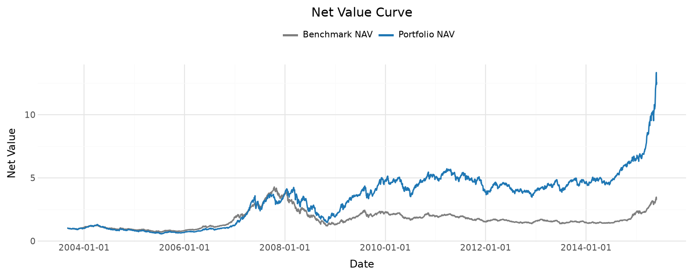
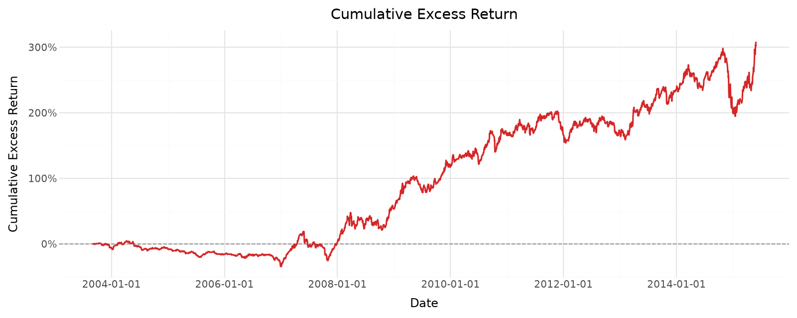

# 量化研究作品集

本仓库是我的量化研究作品集，面向量化研究、金融数据分析、策略研究和资产配置相关岗位，展示从金融数据清洗、因子构建、计量建模到策略回测与结果解释的完整研究能力。

项目主要以 Jupyter Notebook 形式呈现，覆盖资产定价、因子研究、时间序列建模和价值投资策略复现。由于原始行情、财务和研报数据受数据库授权或版权限制，仓库保留研究代码、部分执行结果、图表和指标汇总，用于展示研究流程和分析思路。

## 适合岗位

- 量化研究实习生 / Quant Research Intern
- 金融数据分析 / Financial Data Analyst
- 策略研究助理 / Investment or Strategy Research Assistant
- 资产定价、因子研究、组合回测相关岗位

## 项目列表

| 项目 | 研究主题 | 核心结论 / 展示重点 | 主要能力 |
|---|---|---|---|
| [`beta-estimation`](beta-estimation/) | CAPM Beta 估计与横截面 Beta 分析 | 使用 CAPM 回归和滚动窗口估计股票风险暴露，并进一步观察 Beta 在行业和横截面分组中的分布特征。 | 回归建模、滚动估计、行业聚合、风险暴露分析 |
| [`factor-research`](factor-research/) | PE 单因子检验与 Fama-French 因子复现 | 检验低 PE 组合相对高 PE 组合的收益表现，并通过 CAPM、Fama-French 回归和 Newey-West t 值评估 Alpha 稳健性；同时复现 Fama-French 核心因子并与官方因子对比。 | 分组回测、因子构建、多因子回归、稳健标准误 |
| [`time-series`](time-series/) | 跨市场波动溢出与指数预测 | 使用 VECM、IRF、FEVD 和 GARCH 分析股市、债市、汇率与货币政策变量的联动关系；使用 ARIMA/SARIMA 对上证指数进行样本外预测和简单择时测试。 | 时间序列诊断、VECM、GARCH、ARIMA/SARIMA、预测评估 |
| [`value-investing`](value-investing/) | Steve Loughran 价值选股策略复现 | 将研报中的价值选股规则转化为 A 股月度信号和日度回测流程；在样本期内组合年化收益约 24.2%，上证指数年化收益约 10.6%，年化超额收益约 12.8%。 | 财务数据清洗、财报滞后处理、股票池构建、组合回测、可视化 |

## 关键图表预览

当前 `value-investing` 项目包含完整的图表、表格和 HTML 摘要页，适合快速查看策略表现。





更多输出见 [`value-investing/outputs/steve_loughran_value_screening/`](value-investing/outputs/steve_loughran_value_screening/)。

## 研究能力概览

- 金融数据清洗与时点处理：处理行情、财务、行业分类和宏观金融变量，关注财报可得时间和调仓时点。
- 因子构建与分组回测：构建估值、规模、价值、盈利能力和投资因子，并进行分位数组合检验。
- 回归模型与统计检验：使用 CAPM、Fama-French 回归、Newey-West 标准误和 Alpha 显著性检验。
- 时间序列建模：使用 ADF、ARCH 检验、VECM、GARCH、ARIMA/SARIMA、IRF 和 FEVD。
- 策略回测与绩效评估：计算年化收益、超额收益、波动率、Sharpe、Beta、最大回撤、胜率、换手率和交易成本。
- 复现与差异分析：对比研报或官方因子结果，解释由数据覆盖、口径定义和调仓假设带来的差异。

## 目录结构

```text
.
├── beta-estimation/
├── factor-research/
├── time-series/
├── value-investing/
├── DATA.md
├── requirements.txt
└── README.md
```

## 数据说明

原始行情、财务、行业分类和研报文件未包含在仓库中。这些数据来自 CSMAR、Wind 等授权数据库，或来自有版权限制的研究报告。

Notebook 中保留了研究逻辑和部分结果展示。如需重新运行，请根据自己的本地数据路径进行调整。详细说明见 `DATA.md`。

## 环境依赖

项目使用 Python 及常见量化研究库，包括 pandas、numpy、statsmodels、scipy、plotnine、matplotlib、arch、pmdarima 等。

## 作品集定位

这些项目是研究型 Notebook，不是生产级交易系统。重点在于展示研究问题拆解、数据处理、模型实现、结果检验和风险解释能力，而不是提供可直接交易的自动化系统。
